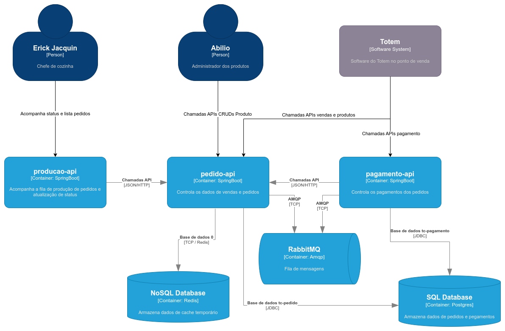

# PAGAMENTO API

Serviço responsável pelos o controle de fluxos de pagamento.
As principais funcionalidades são:

- Checkout de pedido
- Webhook de alteração de status de pagamento

## Diagrama Arquitetural da comunicação entre os serviços

## Definição dos pacotes

Os pacotes seguem uma estrutura simples de separação exemplificada a seguir:

- [clients](src%2Fmain%2Fjava%2Fbr%2Fcom%2Ffiap%2Fsoat1%2Ft32%2Fclients)

- [controllers](src%2Fmain%2Fjava%2Fbr%2Fcom%2Ffiap%2Fsoat1%2Ft32%2Fcontrollers)

- [enums](src%2Fmain%2Fjava%2Fbr%2Fcom%2Ffiap%2Fsoat1%2Ft32%2Fenums)

- [exceptions](src%2Fmain%2Fjava%2Fbr%2Fcom%2Ffiap%2Fsoat1%2Ft32%2Fexceptions)

- [models](src%2Fmain%2Fjava%2Fbr%2Fcom%2Ffiap%2Fsoat1%2Ft32%2Fmodels)

- [repositories](src%2Fmain%2Fjava%2Fbr%2Fcom%2Ffiap%2Fsoat1%2Ft32%2Frepositories)

- [services](src%2Fmain%2Fjava%2Fbr%2Fcom%2Ffiap%2Fsoat1%2Ft32%2Fservices)

- [mappers](src%2Fmain%2Fjava%2Fbr%2Fcom%2Ffiap%2Fsoat1%2Ft32%2Futils%2Fmappers)

## Definições de testes

Para os testes de unidade, foram considerados os pacotes <b>controllers</b> e <b>services</b>.

Para services, utilizamos o Mockito para mockar toda a camada repository e validar as regras de negócio isoladamente.

Nas controllers, fizemos o mock das services e validamos contratos das APIs.

Para calcular a cobertura de teste do projeto utilizando o Jacoco, basta executar o comando `mvn clean install` e acessar o resultado do cálculo na pasta target/site/jacoco/index.html.